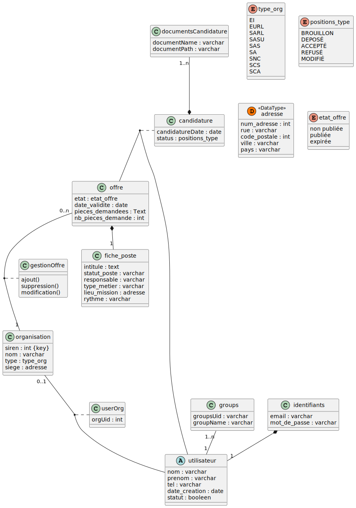

<h1>SR10-P23 / Projet -- Plateforme de Recrutement </h1>

 
Le Projet Plateforme de Recrutemen est un projet développé dans le cadre de l'UV SR10 à l'UTC. Ce projet a été supervisé par :   AKHERAZ Mohamed     Il a été développé par : DOUDECH
Taieb Rayan

<h1>Qu'est ce que Carck Project ?</h1>
  Le but de ce projet est de créer une plateforme de recrutement afin d'appréhénder le développement Web  

Le projet est écris : 
Backend : en JS sous express (Node.js).
Frontend : HTML + CSS + Utilisation du Framework Bootstrap

Une release sera disponnible à la mi-mai 2023.

## Modélisation du projet 

<h2> Modélisation UML du Projet </h2>

<h2> MPD + MCD </h2>

