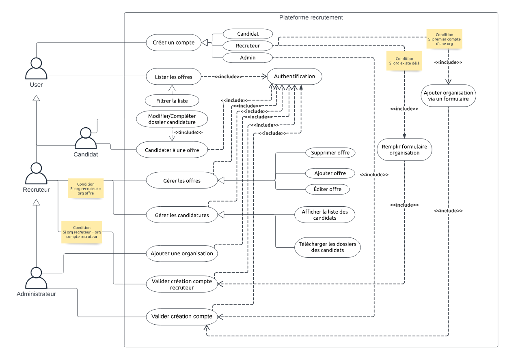
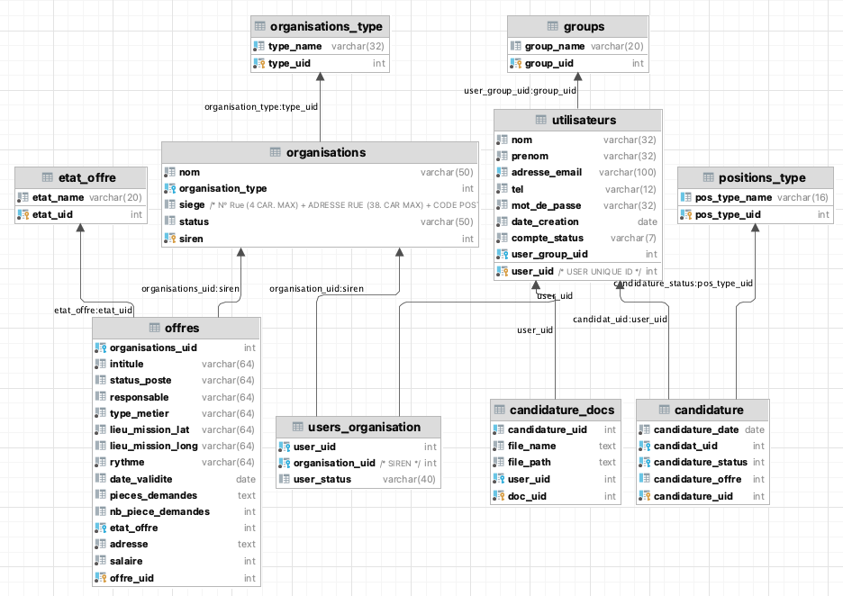

<h1>SR10-P23 / Projet - Plateforme de Recrutement / UT'OPIA - WORK </h1>
<div style="text-align: center;"> 
    <p align="center">Le Projet Plateforme de Recrutemen est un projet développé dans le cadre de l'UV SR10 à l'UTC en P23. Ce projet a été supervisé par : <br> AKHERAZ Mohamed</p>
    <p style="font-size: 0.8rem; margin-top: 4vh"> Par <a href="https://github.com/RayanDoudech" target="_blank" style="color: darkred">DOUDECH Taïeb Rayen</a> dans le cadre de l'UV SR10 en P23</p>
</div>


#### Le projet n'est pas maintenu !! Néanmoins, les PRs sont la bienvenue et seront étudiées !

<h1>Qu'est ce que UT'OPIA - WORK
 ?</h1>
Le but de ce projet est de créer une plateforme de recrutement afin d'appréhender le développement Web en respectant le modèle MVC, Le projet est écrit en : 
<ul>
<li>Backend : en JS sous express (Node.js).</li>
<li>Frontend : HTML + JS + CSS + Utilisation du Framework Bootstrap</li>
</ul>

## Code source du projet

Le code source du projet est disponible dans <br>"0.1 - PLATEFORME_RECRUTEMENT" <br>

## Modélisation du projet 

<div style="text-align: center"><h2> Diagramme de cas d'utilisation</h2></div>

<div style="display :flex; align-items : center; justify-content: center">

</div>

<div style="text-align: center"><h2> Wireframe </h2></div>

<div style="display :flex; align-items : center; justify-content: center">
<p style="font-weight: bold">Le diagramme de cas d'utilisation se trouve dans <a href="/res/wireframe.pdf" target="_blank">res/diag-cas-utilisation.pdf</a></p>
</div>

<div style="text-align: center"><h2> Modélisation UML du Projet </h2></div>

<div style="display :flex; align-items : center; justify-content: center">

</div>

<div style="text-align: center"><h2> MPD + MCD INITIAL </h2></div>

<div style="display :flex; align-items : center; justify-content: center">

</div>

<div style="text-align: center"><h2> MPD + MCD FINALE </h2></div>

<div style="display :flex; align-items : center; justify-content: center">

</div>

# Les changements dans le MPD et Pourquoi avoir fait ces modifications ?
Quels ont été les changements dans le MPD ?
<ul>
<li>La table `postes` n'existe plus à la place tout est centralisé dans offres</li>
<li>La table `user_credentials` n'existe plus à la place tout est centralisé dans utilisateurs</li>
</ul>

Les changements ont été effectués afin de rendre le projet plus modulaire et plus facile à maintenir. Je me suis rendu compte au fil du développement du projet que le projet ne nécessitait pas autant de tables que prévu initialement. Ainsi pour faciliter le développement j'ai fait le choix de diminuer le nombre de tables et conséquemment le nombre de requêtes SQL à effectuer.

# Librairie et Framework utilisés

### Framework et libs Frontend

<ul>
<li>EJS</li>
<li>JQuery</li>
<li>JQuery Datatables - Pour les tables et les filtres</li>
<li>Sweetalert 2 - Pour les popups</li>
</ul>

### Framework et libs Backend

<ul>
<li>NodeJS</li>
<li>Crypto - Hachage de mot de passe</li>
<li>Axios pour quelques requêtes</li>
<li>Passport - Authentification</li>
<li>Passport-local - Authentification</li>
<li>Express-session - Gestion de session</li>
<li>Express-mysql-session - Gestion du stockage de session en SQL</li>
<li>MySQL2 - Database</li>
<li>Express-FileUpload - Envoi de fichier</li>
</ul>

### Quelques utilitaires utilisés :

<ul>
<li>body-parser</li>
<li>bootstrap</li>
<li>cookie-parser</li>
<li>jest - Tests</li>
<li>Supertests - Tests</li>
<li>uuid - Génération de UUID</li>
<li>nodemon - Pour le développement, ne pas devoir relancer l'application constamment</li>
<li>Lottie.json publiques files pour les annimations</li>
<li>Template public bootstrap pour la sidebar</li>
</ul>

# Rapport sur les tests :

Le rapport se trouvent dans <a href="/test.md">test.md</a>

# Rapport sur la sécurité :

Le rapport se trouvent dans <a href="/securite.md">securite.md</a>

# Installation du projet

## Prérequis
<ul>
<li>NodeJS</li>
</ul>

## Installation

### 1. Cloner le projet

``` git clone https://gitlab.utc.fr/tdoudech/sr10_p23_doudech ``` <br>

### 2. Installer les dépendances

``` npm install ```

### 3. Créer la base de données

Importer les seeds scripts disponible dans le dossier `seeds` dans le dossier `res` dans votre base de données.
## ATTENTION : Les seeds scripts doivent être importés dans l'ordre suivant :
```organisations_types > groups > positions_types > etat_offre > utilisateurs > organisations > offres > users_organisation > candidature_docs > candidature```

Les seeds scripts contiennent déjà des données pour faciliter les tests, il est donc inutile de les importer plusieurs fois.

Plusieurs comptes sont déjà crées via les seeds scripts, tous les mots de passe sont ```password``` et sont pré-remplis dans le formulaire de connexion les comptes sont :
<ul>
<li>admin@demo.fr</li>
<li>recruteur@demo.fr</li>
<li>user@demo.fr</li>
<li>utilisateur@demo.fr</li>
<li>test99@demo.fr</li>
</ul>

### Modifier le fichier de configuration
Modifier le fichier pour insérer la configuration de votre BDD :
``` 0.1 - PLATEFORME_RECRUTEMENT/models/database/db.js ```

Il suffit de modifier la partie suivante en insérant vos creds :
```
const pool = mysql.createConnection({
    host: "",
    user: "SR10",
    password: "",
    database: "",
    port: 3306,
});
```


### Optionnel : Ajouter votre propre clef Maps. 

Nous utilisons l'API de Google Maps afin de géolocaliser les entreprises en fonction des coordonnées GPS. Pour activer cette feature, vous pourrez ajouter votre propre clef dans le fichier suivant :
- ``` 0.1 - PLATEFORME_RECRUTEMENT/models/offre.js ``` à la ligne 305 à la place de ```PUT_YOUR_OWN_MAPS_KEY_HERE```
- ``` 0.1 - PLATEFORME_RECRUTEMENT/models/organisation.js ``` à la ligne 308 à la place de ```PUT_YOUR_OWN_MAPS_KEY_HERE```

Il faut aussi effectuer cette manipulation dans le fichier suivant :
- ``` 0.1 - PLATEFORME_RECRUTEMENT/views/public/candidature.ejs ``` à la ligne 110 à la place de ```PUT_YOUR_OWN_MAPS_KEY_HERE```
- ```0.1 - PLATEFORME_RECRUTEMENT/views/organisation/offers-creation.ejs ``` aux lignes 90 et 209 à la place de ```PUT_YOUR_OWN_MAPS_KEY_HERE```

Toutes les clefs Google Maps utilisé durant ce projet ont été supprimés, il est donc nécessaire d'ajouter votre propre clef pour pouvoir utiliser cette feature.

Vous pouvez créer une clef maps en suivant ce lien : <a href="https://developers.google.com/maps/documentation/javascript/get-api-key">Use API Keys - Maps JS API</a>

### 4. Lancer le projet
    cd 0.1\ -\ PLATEFORME_RECRUTEMENT/
    npm start

Bonne utilisation et bon dév :)
